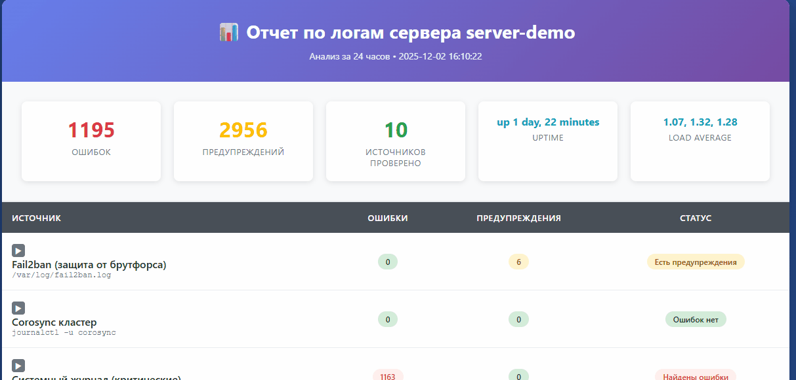

# Fast log check tool

Утилита для быстрой проверки логов на linux-серверах.  
Пробегается по списку серверов, собирает ошибки из логов и создает отчет.  
Список можно задавать в параметрах, брать из файла или из конфига ssh.  
Есть специальный режим для вызова AI-агентами.  
Есть готовый [SKILL](./.claude/skills/log-checker/SKILL.md)

Каждый раздел в отчете можно [развернуть до детальных записей](https://htmlpreview.github.io/?https://github.com/rsyuzyov/fastlogcheck/blob/main/docs/example-report.html)  
<a href="https://htmlpreview.github.io/?https://github.com/rsyuzyov/fastlogcheck/blob/main/docs/example-report.html"></a>

## Быстрый старт

Скачайте файл со страницы [Releases](https://github.com/rsyuzyov/fastlogcheck/releases):

- **Linux:** `fast-log-check-linux-amd64`
- **Windows:** `fast-log-check-windows-amd64.exe`

Запустите и следуйте инструкциям

```bash
./fast-log-check-linux-amd64
```

## Документация

- 📖 **[Инструкция по использованию (USAGE.md)](docs/USAGE.md)** — параметры командной строки, примеры, настройка группировки и AI-интеграция.
- 🛠️ **[Разработка и тестирование (DEVELOPMENT.md)](docs/DEVELOPMENT.md)** — запуск тестов, CI/CD и добавление новых проверок.
